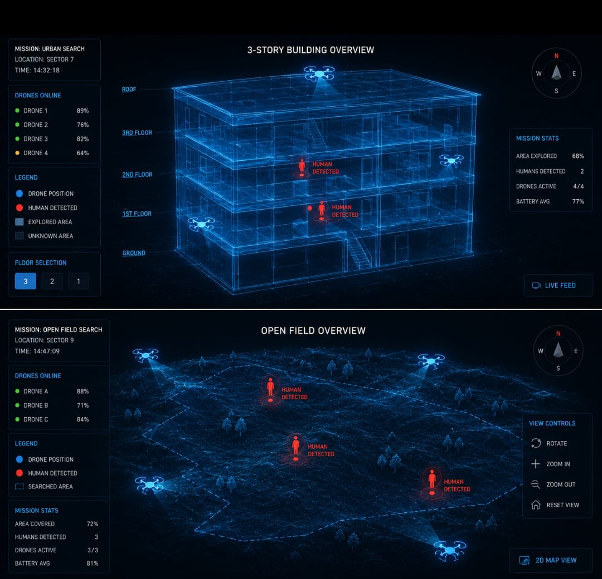
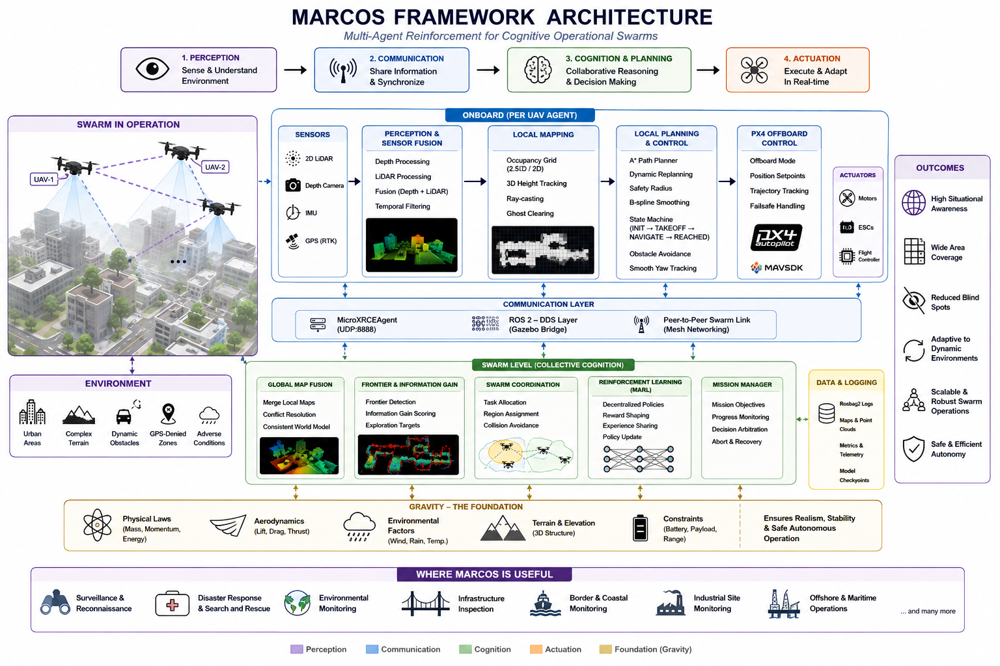

# MARCOS: Multi-Agent Reinforcement for Cognitive Operational Swarms

**Multi-Agent Swarm Intelligence for Autonomous Exploration and Surveillance**

  

---

## Table of Contents

1.  [What is MARCOS?](#what-is-marcos)
2.  [The MARCOS Framework](#the-marcos-framework)
3.  [System Architecture & Tech Stack](#system-architecture--tech-stack)
4.  [Key Features](#key-features)
5.  [Roadmap & Progress](#roadmap--progress)
6.  [Getting Started](#getting-started)
7.  [License](#license)

---

## What is MARCOS?

MARCOS is an intelligent swarm-based framework designed to enable multiple autonomous drones to collaboratively explore, map, and monitor unknown environments.

**The Problem:** Modern surveillance, reconnaissance, and search-and-rescue operations suffer from limited situational awareness due to blind spots, restricted visibility, and the inability of single autonomous systems to efficiently cover large or complex environments.

**The Solution:** MARCOS addresses these challenges by creating a unified operational view of the explored area. Each drone acts as an intelligent agent capable of navigating independently while continuously exchanging information with other swarm members. This reduces blind spots, improves overall coverage efficiency, and provides a unified tactical picture to operators.

### Where is MARCOS Useful?
- **Military Reconnaissance & Surveillance:** Covertly mapping enemy terrain and identifying threats.
- **Disaster Management:** Rapidly searching for survivors in collapsed buildings or flooded zones.
- **Infrastructure Inspection:** Monitoring large and complex structures like bridges, dams, and power lines.
- **Search and Rescue:** Coordinating a swarm to cover vast areas quickly and efficiently.

---

## The MARCOS Framework

The framework is built upon a robust, multi-layered architecture designed for autonomous, collaborative, and safe operation.

  

### 1. The Perception Layer: Seeing the Unseen
This layer is responsible for processing sensor data to understand the environment.

- **Sensor Fusion & Processing:** Raw data from Depth Cameras and 2D LIDAR is fused and processed. The environment is divided into three sectors (Left, Front, Right) for efficient obstacle detection. Temporal filtering is applied to reduce noise.
- **Mapping:** A global **2.5D Occupancy Grid (2000×2000)** is generated for mapping the environment. The system uses **Ray-casting** to build the map and **Ghost Clearing** to remove false obstacles as the drone moves, ensuring an accurate representation. A 3D height map is also maintained to track vertical structures.

### 2. The Planning Layer: Finding the Path
This layer determines where each drone should go, both globally and locally.

- **Path Planner:** A **Dynamic A*** (A-Star) algorithm computes the optimal global path. It considers a **Safety Radius Inflation** around obstacles and performs **Adaptive Replanning** at **2 Hz** to adjust to dynamic changes. The path is smoothed using a **B-spline** for smooth flight.
- **Costmap Generation:** A local costmap is generated from the occupancy grid and sensor data to evaluate the "cost" of traversing different areas.

### 3. The Control Layer: Safe & Smart Navigation
This layer translates the high-level path into low-level commands for the drone while ensuring safety.

- **Smart Obstacle Navigator (State Machine):** The drone's behavior is managed by a finite state machine:
    - **INIT:** System startup and initialization.
    - **TAKEOFF:** Controlled ascent to a predefined altitude.
    - **NAVIGATE:** Following the planned path while avoiding obstacles.
    - **REACHED:** Reaching the final waypoint.
- **Core Capabilities:**
    - **Adaptive Speed:** The drone's velocity is adjusted based on the proximity of obstacles or the complexity of the terrain.
    - **Corridor Centering:** The drone maintains a safe distance from obstacles and tries to fly through the center of free space.
    - **Emergency Avoidance:** If an unexpected obstacle is detected, the drone executes a collision-avoidance maneuver before resuming its path.
    - **Path Following & Smooth Yaw Tracking:** The drone precisely follows the planned path with smooth heading adjustments.

### 4. The Actuation Layer: Commanding the Drone
This layer interfaces directly with the flight controller.

- **PX4 Flight Controller (Offboard Mode):** The high-level setpoints from the Control Layer are sent to the PX4 flight controller. This includes position, velocity, and yaw commands for precise trajectory tracking. Communication is handled via the MicroXRCEAgent (UDP:8888) for low-latency control and clock synchronization.

---

## System Architecture & Tech Stack

The simulation environment provides a high-fidelity digital twin for safe testing before real-world deployment.

### Core Technologies
- **Simulation:** Gazebo (Harmonic) with PX4 SITL for drone physics and environment simulation.
- **Communication:** ROS 2 (Humble) with MicroXRCEAgent for PX4-ROS2 bridging and the ROS-Gazebo Bridge.
- **Perception:** Depth Camera and 2D LIDAR simulation plugins.
- **Algorithms:** Occupancy Grid, Dynamic A*, B-spline smoothing, Sensor Fusion.
- **Visualization:** RViz2 for real-time visualization of the occupancy grid, 3D voxel map, planned path, and LIDAR point cloud.

---

## Key Features

- ✅ **Multi-Agent Coordination:** Framework designed for collaborative swarm operations.
- ✅ **Sensor Fusion:** Integrates Depth and LIDAR data for robust perception.
- ✅ **2.5D Occupancy Grid Mapping:** Real-time creation of a high-resolution shared map.
- ✅ **Dynamic A* Global Planning:** Adaptive path planning with obstacle inflation.
- ✅ **Smart Obstacle Navigation:** State-machine based control with emergency avoidance.
- ✅ **PX4 Offboard Control:** Seamless integration for high-precision trajectory tracking.
- ✅ **Digital Twin Simulation:** Safe and comprehensive testing in Gazebo.

---

## Roadmap & Progress

This section outlines the development phases of the MARCOS project. Tasks marked with a checkmark (✅) are complete.

### Phase 1: Foundation & Simulation (Completed)
- ✅ **Project Setup:** ROS 2, PX4 SITL, and Gazebo Harmonic integration.
- ✅ **Single Drone Simulation:** Successful simulation of a single drone with manual control.
- ✅ **Basic Perception Pipeline:** Setup of Depth Camera and 2D LIDAR data streams.
- ✅ **Communication Layer:** Established MicroXRCEAgent bridge (UDP:8888).
- ✅ **Initial Mapping:** Implemented basic Occupancy Grid generation via Ray-casting.

### Phase 2: Core Autonomy (In Progress)
- ✅ **Sensor Fusion:** Developed LIDAR + Depth sensor fusion and processing.
- ✅ **Global Path Planning:** Integrated Dynamic A* with safety radius inflation.
- ✅ **State Machine:** Implemented the INIT → TAKEOFF → NAVIGATE → REACHED states.
- 🟨 **Smart Obstacle Navigator:** Core logic for adaptive speed and corridor centering is under development.
- 🟨 **Exploration Strategy:** Planning exploration strategies to maximize coverage and reduce blind spots.

### Phase 3: Multi-Agent Swarm (Planned)
- ⬜ **Multi-Drone Simulation:** Spawning and controlling multiple drones in the same Gazebo environment.
- ⬜ **Shared World Model:** Developing the communication protocol for sharing maps and state information between agents.
- ⬜ **Swarm Coordination Logic:** Implementing task allocation and cooperative exploration strategies.
- ⬜ **Reinforcement Learning Integration:** Introduction of RL agents for swarm-level decision-making.

### Phase 4: Advanced Capabilities & Deployment (Planned)
- ⬜ **Human/Object Detection:** Integrating Computer Vision for target classification.
- ⬜ **Advanced Mapping:** 3D voxel map generation and improved ghost clearing.
- ⬜ **Hardware-in-the-loop (HITL):** Testing the software stack with real flight controllers.
- ⬜ **Real Drone Deployment:** Transitioning the system to physical drones.

---

## License

This project is licensed under the GNU General Public License v3.0 - see the [LICENSE](LICENSE) file for details.

---

## Author

- Prathamesh Jakkula

---